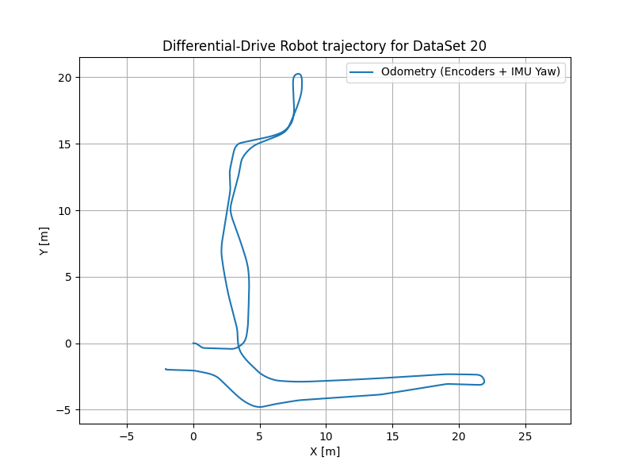
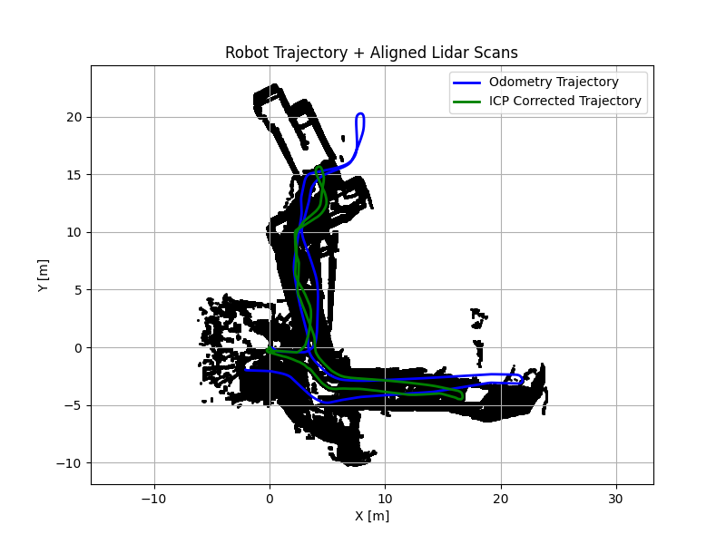

This project focuses on **robot localization and mapping** using various sensor data, including encoders, IMU, LiDAR, and a Kinect sensor. It implements several key robotics algorithms, such as odometry computation, Iterative Closest Point (ICP) for scan matching, occupancy grid mapping, pose graph optimization, and 3D textured map generation.

The project is structured into several Python scripts, each handling a specific part of the localization and mapping pipeline.

## Project Structure

  * `load_data.py`: Handles loading the sensor data from `.npz` files.
  * `part1.py`: Computes the robot's odometry (trajectory) using encoder counts and IMU yaw rate.
  * `pr2_utils.py`: Provides utility functions, including Bresenham's ray tracing algorithm for map updates and plotting functions.
  * `scan_matching2.py`: Implements the Iterative Closest Point (ICP) algorithm for LiDAR scan matching and uses it to compute a refined robot trajectory.
  * `Occupancy.py`: Builds an occupancy grid map of the environment using the refined trajectory from ICP and LiDAR scans.
  * `texture.py`: Generates a 3D textured map by integrating Kinect disparity and RGB data with the robot's estimated poses.
  * `pose_graph_optimization.py`: Performs pose graph optimization using GTSAM to further refine the robot's trajectory by incorporating loop closure constraints.
  * `test_gtsam.py`: A simple script to verify the GTSAM Python installation.
  * `test.py`: A script to generate sample point clouds from disparity images and visualize them using Open3D.

## Setup Instructions

### 1\. Clone the Repository

```bash
git clone <r[epository_url](https://github.com/ivanlin328/LiDAR-Based-SLAM.git)>
cd <LiDAR-Based-SLAM>
```

### 2\. Set up a Python Environment

It is highly recommended to use a virtual environment.

```bash
python3 -m venv venv
source venv/bin/activate  # On Windows: `venv\Scripts\activate`
```

### 3\. Install Dependencies

Install the required Python packages:

```bash
pip install numpy matplotlib scipy opencv-python open3d tqdm gtsam
```

**Note on GTSAM:**
If `pip install gtsam` fails, you might need to build GTSAM from source with Python wrappers. Refer to the official GTSAM documentation for detailed installation instructions: [https://gtsam.org/](https://gtsam.org/)

### 4\. Data

The project expects sensor data to be located in a `data` directory at the same level as the Python scripts. The `test.py` and `texture.py` scripts also expect a `dataRGBD` directory.

**Create the `data` and `dataRGBD` directories:**

```bash
mkdir data
mkdir dataRGBD
```

Then, place your `EncodersXX.npz`, `HokuyoXX.npz`, `ImuXX.npz`, and `KinectXX.npz` files (where `XX` is the dataset number, e.g., `20`, `21`) into the `data` directory.

For the Kinect data, ensure you have subdirectories like `dataRGBD/DisparityXX/` and `dataRGBD/RGBXX/` containing the `.png` images. For example:

```
dataRGBD/
├── Disparity20/
│   ├── disparity20_1.png
│   ├── disparity20_2.png
│   └── ...
└── RGB20/
    ├── rgb20_1.png
    ├── rgb20_2.png
    └── ...
```

## Running the Scripts

You can run each component of the pipeline independently.

### 1\. Compute Odometry

To compute and plot the robot's trajectory using encoders and IMU:

```bash
python part1.py
```

### 2\. Test GTSAM Installation

To verify your GTSAM Python installation:

```bash
python test_gtsam.py
```

### 3\. Run Scan Matching (ICP)

To compute a refined trajectory using ICP and visualize the aligned LiDAR scans:

```bash
python scan_matching2.py
```

*(Note: `scan_matching.py` seems to be an earlier or alternative version of `scan_matching2.py`. It's recommended to use `scan_matching2.py` as it's integrated with `Occupancy.py` and `texture.py`.)*

### 4\. Build Occupancy Grid Map

To generate an occupancy grid map of the environment:

```bash
python Occupancy.py
```

This script will also save the generated occupancy map to `occupancy_XX.npz` in the `data` directory (e.g., `occupancy_20.npz`).

### 5\. Generate Textured Map

To create a 3D textured map by integrating Kinect data and overlay it on the occupancy map:

```bash
python texture.py
```

*(This script might take a considerable amount of time to run due to processing a large number of images and point clouds.)*

### 6\. Perform Pose Graph Optimization

To optimize the robot's trajectory using GTSAM and loop closures:

```bash
python pose_graph_optimization.py
```
Results
Here are some visualizations from the project:

Differential-Drive Robot Trajectory (Odometry)

Robot Trajectory + Aligned Lidar Scans (ICP Corrected)

Grid Map (Occupancy Grid)

Floor Texture Map

